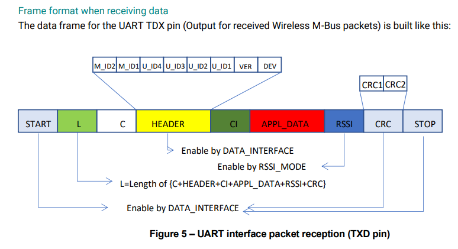

# Wireless M-Bus Packet Format for RC1701HP-MBUS4
For the `Cryo*` receivers, the `DATA_INTERFACE` parameter is disabled so there is no start or stop byte.  Hence each MBUS packet starts with the packet length (L field) - the order of the components are as below:

| # | Name      | Description                                                 |
| - | --------- | ----------------------------------------------------------- |
| 1 | L         | packet length (valid values 1-246 inclusive).               |
| 2 | C         | control field (implements 'message type' in  Mailbox mode). |
| 3 | HEADER    | includes the manufacturer ID and sensor ID                  |
| 4 | CI        | control information byte (not clear)                        |
| 5 | APPL_DATA | application data (payload)                                  |
| 6 | RSSI      | received signal strength (if enabled)                       | 



Hence we can strip all of these features into a "MBus" packet before breaking down further into CryoEgg or CryoWrust packets.

This is complicated however by the fact that we append additional bytes on the end of each packet if they are coming from a CryoEgg receiver, so the length field is modified to account for this.

## Modified M-Bus Packet Format for `Cryo*` Receivers

| #  | Name      | Description                                                  |
| -- | --------- | ------------------------------------------------------------ |
|  1 | L         | packet length: valid values 7-253 inclusive (i.e. {1-246}+7) |
|  2 | C         | control field (implements 'message type' in  Mailbox mode).  |
|  3 | HEADER    | includes the manufacturer ID and sensor ID                   |
|  4 | CI        | control information byte (not clear)                         |
|  5 | APPL_DATA | application data (payload)                                   |
|  6 | RSSI      | received signal strength (if enabled)                        | 
|  7 | CHANNEL   | receiver channel                                             |
|  8 | TEMP      | temperature in degrees (signed, 1 byte)                      |
|  9 | PRESSURE  | barometric pressure in mBar/10 (2 bytes)                     | 
| 10 | VOLTAGE   | battery voltage in mV (2-bytes)                              |

## Algorithm for Reading `Cryo*` Packets
The maximum length of any packet is 253 bytes, hence we can use a FIFO buffer of 255 bytes and left-shift bytes within in it until we can read a valid packet from the the buffer.

```
0. Initialise
    a. Assign buffer[0:255]
    b. Assign buffer_length = 255
1. Left-shift buffer (`buffer[0:254]` = `buffer[1:255]`, `buffer[255]` = `input()`)
    a. If `input()` is null, decrease buffer length by 1
    b. If buffer[0] > buffer_length, then quit
2. Check value in `buffer[0]` is valid length value
    a. If not - return to 1. 
    b. If valid, store length value
3. Check value if `buffer[1]` is valid C-field value
    a. If not - raise exception if length value or? return to 1.
4. Read header from `buffer[2:9]` (8-bytes)
    a. If invalid - return to 1.
    b. If valid - store header and separate out ID
5. Check CI value in `buffer[10]` is valid
    a. If not - return to 1.
// [ Skip payload, we will store this later ]
6. Check RSSI in `buffer[L-6]` is valid (should be < 30dBm and > -127 dBm)
    a. If not - raise Exception for unusual value; this can be handled if required or muted
7. Check Temp in `buffer[L-5]` is valid?
    a. If not - raise Exception for unusual value; this can be handled if required or muted
8. Check Pressure in `buffer[L-4:L-3]` is valid?
    a. If not - raise Exception for unusual value; this can be handled if required or muted
9. Check Voltage in `buffer[L-2:L-1]` is valid?
    a. If not - raise Exception for unusual value; this can be handled if required or muted
10. Store payload from `buffer[11:L-7]`
11. Return to 1.
```